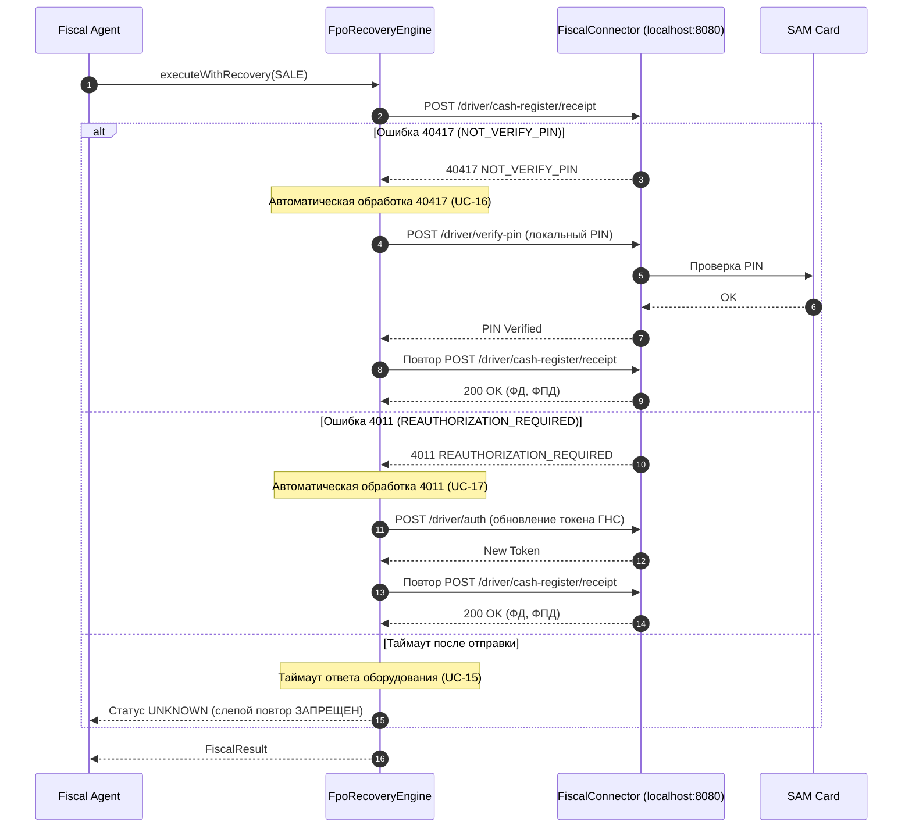
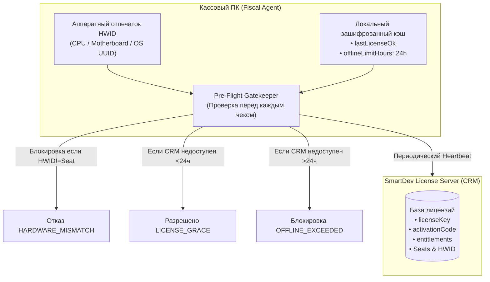

# Документация: Универсальный модуль SmartDev FPO Integration

**SmartDev FPO Integration** — это программная интеграционная платформа для фискализации операций в Государственной налоговой службе Кыргызской Республики (**ФПО КР**) из любых облачных и локальных товароучётных систем (ERP/POS), начиная с профиля **«МойСклад» (Fiscal API 1.0 / Vendor API 1.0)**, с защищенной доставкой команд на кассовые ПК, автоматическим восстановлением при сбоях и независимой аппаратной системой лицензирования SmartDev.

---

## Содержание
1. [Архитектурная концепция и изоляция](#1-архитектурная-концепция-и-изоляция)
2. [Структура проекта и подсистемы](#2-структура-проекта-и-подсистемы)
3. [Универсальная модель данных Core](#3-универсальная-модель-данных-core)
4. [Подсистема провайдеров (Профиль «МойСклад»)](#4-подсистема-провайдеров-профиль-мойсклад)
5. [ФПО Адаптер и механизм Auto-Recovery](#5-фпо-адаптер-и-механизм-auto-recovery)
6. [Подсистема лицензирования SmartDev](#6-подсистема-лицензирования-smartdev)
7. [Локальный Fiscal Agent и Cloud Gateway](#7-локальный-fiscal-agent-и-cloud-gateway)
8. [Руководство по подключению нового провайдера (1C, Frontol, Paloma)](#8-руководство-по-подключению-нового-провайдера)
9. [Справочник API Gateway и маршрутов](#9-справочник-api-gateway-и-маршрутов)
10. [Развёртывание и конфигурация](#10-развёртывание-и-конфигурация)
11. [Сценарии использования (Use Cases UC-01 .. UC-23)](#11-сценарии-использования-use-cases-uc-01--uc-23)
12. [Чек-лист реального тестирования](#12-чек-лист-реального-тестирования)
13. [Источники](#13-источники)

---

## 1. Архитектурная концепция и изоляция

Архитектура системы базируется на фундаментальном принципе: **«Универсальное ядро (Core) + Сменные адаптеры провайдеров (Providers) + Изолированный фискальный модуль (FPO)»**.

```
                      [ Облако МойСклад / 1C / Frontol / Paloma ]
                                          │
                                          ▼ (HTTPS Fiscal API / Vendor API / REST)
                        ┌───────────────────────────────────┐
                        │       SmartDev Cloud Gateway      │
                        │    (Публичные HTTPS эндпоинты)    │
                        └─────────────────┬─────────────────┘
                                          │
                 ┌────────────────────────┼────────────────────────┐
                 ▼                        ▼                        ▼
      ┌─────────────────────┐  ┌─────────────────────┐  ┌─────────────────────┐
      │   Provider Adapter  │  │  Integration Core   │  │   License Server    │
      │     (MOYSKLAD)      │  │  (Универсальное     │  │   (SmartDev CRM     │
      │ • RSA подписи       │  │   ядро операций &   │  │    Seats / HWID     │
      │ • Vendor API 1.0    │  │   идемпотентность)  │  │    Grace window)    │
      │ • PDF/ZIP чеки      │  └──────────┬──────────┘  └─────────────────────┘
      └─────────────────────┘             │
                                          ▼ (Исходящий защищенный WSS-туннель)
                        ┌───────────────────────────────────┐
                        │        Fiscal Agent (Касса)       │
                        │  • Привязка к HWID кассового ПК   │
                        │  • 24ч Оффлайн-грейс кэш          │
                        │  • Авто-восстановление 40417/4011 │
                        │  • Защищенное хранилище PIN       │
                        └─────────────────┬─────────────────┘
                                          │
                                          ▼ (REST localhost:8080 - СТРОГО ВНУТРИ ПК)
                        ┌───────────────────────────────────┐
                        │    FiscalConnector (Драйвер ГНС)  │
                        │        + SAM-карта (Ридер)        │
                        └───────────────────────────────────┘
```

### Ключевые правила безопасности и изоляции:
1. **Zero Provider Leakage:** Внутри ядра (`src/core`), драйвера ФПО (`src/fpo`), лицензирования (`src/licensing`) и агента (`src/agent`) запрещено использование названий полей МоегоСклада (`X-Lognex-*`, `meta.id`, `retailStore.id`, `access_token`). Все они инкапсулированы исключительно в каталоге `src/providers/moysklad/`.
2. **Изоляция кассового оборудования:** Порт фискального регистратора `localhost:8080` никогда не публикуется в интернет. Fiscal Agent сам устанавливает исходящее WebSocket-соединение к Gateway.
3. **Безопасность учетных данных:** PIN-код SAM-карты и пароли ФПО хранятся локально в шифрованном виде (AES-256) и маскируются (`***REDACTED***`) при передаче в центральный аудит.

---

## 2. Структура проекта и подсистемы

```
c:/smartmag/FPO_module/
├── package.json               # Зависимости и скрипты сборки
├── tsconfig.json              # Конфигурация TypeScript
├── jest.config.ts             # Конфигурация тестов Jest
├── README.md                  # Краткое руководство
├── DOCUMENTATION.md           # Полная техническая документация
├── scripts/
│   ├── lint-architecture.js   # Автоматический контроль отсутствия утечки провайдеров
│   └── run-all-tests.js       # Сквозной раннер всех 31 тестов и 23 Use Cases
└── src/
    ├── core/                  # Универсальное интеграционное ядро
    │   ├── operations/        # Нормализованные типы операций (SALE, RETURN, SHIFT и т.д.)
    │   ├── idempotency/       # Менеджер идемпотентности, статусы PROCESSING/SUCCESS/UNKNOWN
    │   ├── audit/             # Журналирование и маскирование секретов
    │   ├── routing/           # Маршрутизация магазинов и соединений агентов
    │   └── orchestrator.ts    # Главный координатор выполнения операций
    ├── providers/             # Адаптеры внешних систем
    │   ├── common/            # Интерфейс IProviderAdapter и ProviderRegistry
    │   ├── mock/              # MockProviderAdapter для тестов изоляции
    │   └── moysklad/          # Адаптер «МойСклад»
    │       ├── security/      # Проверка подписей RSA-SHA256 и заголовков X-Lognex
    │       ├── lifecycle/     # Жизненный цикл Vendor API 1.0 (install/activate/suspend/delete)
    │       ├── mapper/        # Маппинг Fiscal API 1.0 <-> NormalizedFiscalOperation
    │       └── receipt/       # Генерация чеков PDF (56/80/A4 мм) -> ZIP -> Base64
    ├── fpo/                   # Адаптер фискального накопителя Кыргызстана
    │   ├── models/            # DTO запросов и ответов ФПО, ставки налогов (НДС, НСП)
    │   ├── client/            # REST-клиент FiscalConnector (localhost:8080)
    │   ├── recovery/          # Движок авто-восстановления при 40417, 4011, таймаутах
    │   └── mock/              # Полный эмулятор аппаратного FiscalConnector для тестов
    ├── licensing/             # Автономная система лицензирования SmartDev
    │   ├── models/            # Модели лицензий, рабочих мест (Seat), привязок (Bindings)
    │   ├── server/            # Сервер лицензий SmartDev (регистрация, rebind, контроль)
    │   └── client/            # Агентский клиент (HWID, 24-часовой оффлайн-грейс)
    ├── agent/                 # Локальный кассовый агент
    │   ├── agentService.ts    # Координатор операций кассы и диагностика оборудования
    │   ├── secureStorage.ts   # Зашифрованное хранилище секретов (PIN, SAM, RNM)
    │   └── transport/         # Исходящий WebSocket-клиент к Gateway
    └── gateway/               # Облачный шлюз (Fastify)
        ├── gatewayApp.ts      # HTTP-маршруты Vendor API, Fiscal API, License API
        └── transport/         # WebSocket-сервер диспетчеризации агентов
```

---

## 3. Универсальная модель данных Core

Ядро системы работает только с универсальными сущностями, определенными в [`src/core/operations/types.ts`](file:///c:/smartmag/FPO_module/src/core/operations/types.ts).

### Типы операций (`OperationType`):
- `OPEN_SHIFT` — открытие фискальной смены;
- `SALE` — продажа товара / услуги;
- `RETURN` — возврат продажи на основании исходного чека;
- `DEPOSIT` — внесение наличных в денежный ящик;
- `WITHDRAW` — выплата (изъятие) наличных из ящика;
- `CLOSE_SHIFT` — закрытие фискальной смены (формирование Z-отчета);
- `X_REPORT` — локальный промежуточный отчет без гашения смены.

### Статусы операций (`OperationStatus`):
- `PENDING` — операция ожидает отправки;
- `PROCESSING` — команда передана на исполнение в ФПО;
- `SUCCESS` — операция успешно зафиксирована в ФПО, получен фискальный признак (ФПД);
- `UNKNOWN` — ответ от ФПО потерян из-за таймаута после отправки. Слепые повторы **заблокированы** во избежание двойной фискализации;
- `FAILED` — операция отклонена до отправки в ФПО (ошибка валидации, лицензии, отсутствие SAM-карты).

### Налоговые ставки Кыргызской Республики:
- **НДС (VAT):** `VAT_0` (0%), `VAT_12` (12%), `NO_VAT` (без НДС).
- **НСП / Налог с продаж (ST):** `ST_0` (0%), `ST_1` (1%), `ST_2` (2%), `ST_3` (3%), `ST_5` (5%), `NO_ST` (без НСП).
- **Признак предмета расчёта (`calcItemAttributeCode`):** `1` — товар, `2` — подакцизный товар, `3` — работа, `4` — услуга и т.д.

### Модель `NormalizedFiscalOperation`:
```typescript
export interface NormalizedFiscalOperation {
  operationId: string;           // Внутренний GUID операции
  providerCode: string;          // "MOYSKLAD", "1C", "FRONTOL", "MOCK"
  providerAccountId: string;     // Идентификатор тенанта / аккаунта
  externalOperationId: string;   // ID документа во внешней системе
  operationType: OperationType;  // SALE, RETURN, OPEN_SHIFT и т.д.
  storeId: string;               // ID торговой точки
  agentId?: string;              // Целевой локальный агент
  cashier?: { name?: string; inn?: string };
  items?: FiscalItem[];          // Позиции чека с ценами, налогами, маркировкой SGTIN
  payments?: PaymentDetail[];    // Способы оплаты (CASH, CARD, QR, PREPAYMENT)
  totalSum?: number;             // Итоговая сумма чека
  totalCashSum?: number;         // Сумма наличными
  totalCashlessSum?: number;     // Сумма безналичными
  originFiscalDoc?: {            // Реквизиты исходного чека (для возвратов)
    originFdNumber: number;      // Номер исходного ФД
    originFnSerialNumber: string;// Номер ФН
    originDate?: string;
  };
  createdAt: string;
}
```

---

## 4. Подсистема провайдеров (Профиль «МойСклад»)

Каталог: [`src/providers/moysklad/`](file:///c:/smartmag/FPO_module/src/providers/moysklad/)

### 4.1. Жизненный цикл Vendor API 1.0
1. При установке решения МойСклад отправляет `POST /vendor/1.0/apps/{appId}/{accountId}` с `access_token` и публичным ключом RSA (`additional.fiscalApi.token`).
2. Gateway сохраняет установку и возвращает статус `SettingsRequired`.
3. Пользователь в интерфейсе МоегоСклада указывает точку продаж и сопрягает её с локальным Fiscal Agent по одноразовому коду.
4. После сохранения настроек решение переходит в статус `Activated`.
5. Поддерживаются события `SUSPEND` (приостановка), `RESUME` (возобновление) и `DELETE` (удаление с отзывом токенов).

### 4.2. Безопасность и проверка подписи Fiscal API 1.0
Каждый запрос от МоегоСклада содержит обязательные заголовки:
- `X-Lognex-Fiscal-Account-Id`: идентификатор аккаунта;
- `X-Lognex-Fiscal-Signature`: цифровая подпись тела запроса по алгоритму **RSA-SHA256**.
Класс `MoySkladSecurity` сверяет подпись с сохраненным публичным RSA-ключом установки.

### 4.3. Маппинг фискальных операций
- `PUT /1/openshift` ➔ `OPEN_SHIFT`
- `POST /1/retaildemand` ➔ `SALE` (сумма наличных `cashSum` преобразуется в `totalCashSum`, а `cardSum + qrSum + prepaySum` — в `totalCashlessSum`).
- `POST /1/retaisalesreturn` ➔ `RETURN` (автоматическое извлечение `demand.meta` и связывание с исходным чеком).
- `POST /1/retaildrawercashin` ➔ `DEPOSIT`
- `POST /1/retaildrawercashout` ➔ `WITHDRAW`
- `PUT /1/closeshift` ➔ `CLOSE_SHIFT`

### 4.4. Генерация чеков (Печатная форма)
Класс `MoySkladReceiptGenerator` формирует печатную форму:
1. Рендеринг чека в формате PDF (с поддержкой ленты 56 мм, 80 мм или листа А4).
2. Чек содержит реквизиты организации, перечень позиций, налоги (НДС, НСП), маркировку SGTIN, итоговые суммы, РНМ, ЗН ФН, номер ФД, фискальный признак (ФПД) и URL QR-кода проверки чека на портале ГНС КР.
3. Упаковка PDF-файла в архив ZIP.
4. Кодирование ZIP-архива в строку **Base64** и возврат в поле `receipt` ответа Fiscal API.

---

## 5. ФПО Адаптер и механизм Auto-Recovery

Каталог: [`src/fpo/`](file:///c:/smartmag/FPO_module/src/fpo/)

ФПО Адаптер взаимодействует с локальным сервисом `FiscalConnector`, работающим на кассовом ПК по адресу `http://localhost:8080`.

### 5.1. Поддерживаемые эндпоинты драйвера ФПО:
- `GET /driver/sam-cards` — опрос наличия и статуса SAM-карты в ридере.
- `POST /driver/verify-pin` — верификация PIN-кода SAM-карты.
- `POST /driver/auth` — авторизация кассы на сервере ГНС КР с получением сессионного токена.
- `GET /driver/state-shift` — получение статуса смены (`CLOSED`, `OPEN`, `EXPIRED`).
- `POST /driver/open-shift` — открытие смены.
- `POST /driver/cash-register/receipt` — фискализация чека продажи (`INCOME`) или возврата (`INCOME_RETURN`).
- `POST /driver/cash-transaction/deposit` — внесение денег в ящик.
- `POST /driver/cash-transaction/withdraw` — выплата денег из ящика.
- `GET /driver/cash-transaction` — проверка остатка наличных в денежном ящике.
- `POST /driver/close-shift` — закрытие смены (формирование Z-отчета).
- `GET /driver/x-report` — локальный X-отчет.

### 5.2. Движок автоматического восстановления (`FpoRecoveryEngine`):



### 5.3. Правило закрытия смены (Контроль остатка ящика):
Согласно требованиям фискализации в КР, смена не может быть закрыта при наличии наличных в ящике. Перед вызовом `POST /driver/close-shift` агент опрашивает `GET /driver/cash-transaction`. Если остаток $> 0$, операция закрытия блокируется с кодом `DRAWER_NOT_EMPTY` (**UC-13**) с требованием выполнить выплату (`withdraw`).

---

## 6. Подсистема лицензирования SmartDev

Каталог: [`src/licensing/`](file:///c:/smartmag/FPO_module/src/licensing/)

Система лицензирования SmartDev полностью автономна и не зависит от статуса приложений в МоемСкладе.



### 6.1. Активация и рабочие места (Seat)
1. Клиент получает `activationCode` в SmartDev CRM.
2. При первом запуске Agent генерирует аппаратный отпечаток `hardwareId` (HWID) и вызывает `POST /api/v1/module/register`.
3. Сервер регистрирует Seat (`agentId` + `hardwareId`), проверяет лимит `maxAgents` и выдает постоянный `license_key` и `device_token` (**UC-19**).

### 6.2. Защита от клонирования (`HARDWARE_MISMATCH`)
Если папка агента или образ диска копируются на другой ПК, отпечаток `hardwareId` изменится. Gatekeeper немедленно заблокирует фискализацию с ошибкой `HARDWARE_MISMATCH` (**UC-22**) до тех пор, пока администратор SmartDev не выполнит процедуру `rebind` по защищенному мастер-ключу.

### 6.3. 24-часовой оффлайн-грейс (`offlineLimitHours`)
При временном обрыве связи с сервером лицензий SmartDev касса продолжает бесперебойную работу по локальному зашифрованному кэшу в течение **24 часов** с момента последней успешной проверки (**UC-20**). Событие фиксируется в аудите как `LICENSE_GRACE`. По истечении 24 часов новые операции блокируются до восстановления связи.

---

## 7. Локальный Fiscal Agent и Cloud Gateway

### 7.1. Fiscal Agent (`src/agent`)
Локальный демон, устанавливаемый на кассовый ПК как служба Windows/Linux:
- Хранит зашифрованные AES-256 секреты в `SecureLocalStorage` ([`secureStorage.ts`](file:///c:/smartmag/FPO_module/src/agent/secureStorage.ts)).
- Устанавливает исходящее WebSocket-соединение с Gateway ([`agentWsClient.ts`](file:///c:/smartmag/FPO_module/src/agent/transport/agentWsClient.ts)).
- Поддерживает автоматическое переподключение с настраиваемым интервалом.
- Выполняет локальную самодиагностику оборудования: проверка связи с FiscalConnector, наличие SAM-карты, верификация PIN, опрос РНМ ([`agentService.ts`](file:///c:/smartmag/FPO_module/src/agent/agentService.ts)).

### 7.2. Cloud Gateway (`src/gateway`)
Облачный сервис на базе Fastify:
- Принимает внешние HTTPS вебхуки МоегоСклада и других провайдеров.
- Маршрутизирует входящие запросы в нужные адаптеры провайдеров.
- Поддерживает постоянные WSS-сессии со всеми подключенными кассовыми агентами ([`gatewayWsServer.ts`](file:///c:/smartmag/FPO_module/src/gateway/transport/gatewayWsServer.ts)).
- Обеспечивает связывание `storeId` ➔ `agentId`.

---

## 8. Руководство по подключению нового провайдера

Для подключения новой товароучётной системы (например, **1С:Предприятие**, **Frontol** или **Paloma365**) **не требуется изменять ни одной строчки кода** в `core/`, `fpo/`, `licensing/` и `agent/`.

### Пошаговая инструкция:

#### Шаг 1. Создайте каталог адаптера
Создайте папку `src/providers/onec/` (или имя вашей системы).

#### Шаг 2. Реализуйте интерфейс `IProviderAdapter`
```typescript
import { IProviderAdapter, NormalizedFiscalOperation, FiscalResult, ReceiptData, OperationType } from '../../core';

export class OneCProviderAdapter implements IProviderAdapter {
  public readonly providerCode = '1C';

  // Проверка авторизации входящего запроса от 1С
  async verifyRequest(req: any) {
    const auth = req.headers['authorization'];
    return { valid: auth === 'Bearer 1c-secret-token', accountId: '1c-tenant-01' };
  }

  // Преобразование формата 1С в NormalizedFiscalOperation
  async mapToNormalized(rawRequest: any): Promise<NormalizedFiscalOperation> {
    const body = rawRequest.body;
    return {
      operationId: `1c-op-${Date.now()}`,
      providerCode: this.providerCode,
      providerAccountId: '1c-tenant-01',
      externalOperationId: body.DocumentNumber,
      operationType: body.Type === 'Sale' ? OperationType.SALE : OperationType.RETURN,
      storeId: body.WarehouseId || 'main-store',
      totalSum: body.TotalSum,
      totalCashSum: body.CashSum || 0,
      totalCashlessSum: body.CardSum || 0,
      items: body.Items.map((item: any) => ({
        name: item.Name,
        price: item.Price,
        quantity: item.Quantity,
        totalSum: item.Sum,
        calcItemAttributeCode: item.ItemType || 1
      })),
      createdAt: new Date().toISOString()
    };
  }

  // Преобразование результата фискализации в формат ответа 1С
  async mapToProviderResponse(result: FiscalResult) {
    return {
      statusCode: result.success ? 200 : 400,
      body: {
        Success: result.success,
        FiscalDocNumber: result.fiscalDocNumber,
        FiscalSign: result.fiscalDocSign,
        RNM: result.kktRegNumber,
        ErrorMessage: result.error?.message
      }
    };
  }

  // Формирование чека для 1С (текст, Esc/POS или PDF)
  async generateReceiptData(operation: NormalizedFiscalOperation, result: Partial<FiscalResult>): Promise<ReceiptData> {
    return {
      format: 'RAW_TEXT',
      data: `ЧЕК 1С: ${operation.totalSum} KGS, ФПД: ${result.fiscalDocSign}`
    };
  }
}
```

#### Шаг 3. Зарегистрируйте адаптер в Gateway
В файле `src/gateway/gatewayApp.ts`:
```typescript
orchestrator.providerRegistry.register(new OneCProviderAdapter());
```

Теперь эндпоинт `POST /api/v1/providers/1C/fiscal` автоматически фискализирует чеки из 1С в ФПО КР со всеми механизмами защиты и контроля лицензий!

---

## 9. Справочник API Gateway и маршрутов

### 9.1. Маршруты Vendor API 1.0 (МойСклад Lifecycle)
| Метод | Эндпоинт | Назначение |
|---|---|---|
| `POST` | `/vendor/1.0/apps/:appId/:accountId` | Установка решения из каталога (возвращает `SettingsRequired`) |
| `PUT` | `/vendor/1.0/apps/:appId/:accountId` | Сохранение настроек точки продаж и агента (переход в `Activated`) |
| `DELETE` | `/vendor/1.0/apps/:appId/:accountId` | Удаление решения и отзыв токенов |
| `POST` | `/vendor/1.0/apps/:appId/:accountId/suspend` | Приостановка решения |
| `POST` | `/vendor/1.0/apps/:appId/:accountId/resume` | Возобновление работы решения |

### 9.2. Маршруты Fiscal API 1.0 (МойСклад)
| Метод | Эндпоинты | Тип операции |
|---|---|---|
| `PUT` | `/1/openshift`, `/fiscal/1.0/openshift` | Открытие смены |
| `POST` | `/1/retaildemand`, `/fiscal/1.0/retaildemand` | Фискализация продажи (чек) |
| `POST` | `/1/retaisalesreturn`, `/fiscal/1.0/retaisalesreturn` | Фискализация возврата продажи |
| `POST` | `/1/retaildrawercashin`, `/fiscal/1.0/retaildrawercashin` | Внесение наличных в кассу |
| `POST` | `/1/retaildrawercashout`, `/fiscal/1.0/retaildrawercashout` | Выплата наличных из кассы |
| `PUT` | `/1/closeshift`, `/fiscal/1.0/closeshift` | Закрытие смены (Z-отчет) |

### 9.3. Универсальные фискальные маршруты
| Метод | Эндпоинт | Назначение |
|---|---|---|
| `POST` | `/api/v1/providers/:providerCode/fiscal` | Универсальная фискализация для любого зарегистрированного провайдера (`1C`, `FRONTOL`, `MOCK`) |

### 9.4. Маршруты SmartDev License Server
| Метод | Эндпоинт | Назначение |
|---|---|---|
| `POST` | `/api/v1/module/register` | Регистрация рабочего места по коду активации |
| `POST` | `/api/v1/module/verify` | Pre-flight проверка лицензии перед чеком |
| `POST` | `/api/v1/module/heartbeat` | Периодический опрос статуса лицензии |
| `POST` | `/api/v1/module/rebind` | Авторизованная смена аппаратного профиля (HWID) |

### 9.5. WebSocket-эндпоинт
- `ws://<host>:<port>/agent-ws?agentId=...&token=...` — постоянный канал связи Gateway с локальным кассовым агентом.

---

## 10. Развёртывание и конфигурация

### 10.1. Требования к окружению
- **Node.js:** версия 20.x, 22.x или 24.x LTS.
- **ОС:** Windows 10/11 / Windows Server (для кассовых ПК с FiscalConnector), Linux / Docker (для облачного Gateway).

### 10.2. Переменные окружения Gateway (`.env`)
```ini
PORT=8462
HOST=0.0.0.0
NODE_ENV=production
PUBLIC_GATEWAY_URL=https://esepmoysclad.smartdev.kg
MOYSKLAD_STORAGE_PATH=./data/moysklad-installations.enc
MOYSKLAD_STORAGE_KEY=<32-byte-or-long-secret>
SMARTDEV_LICENSE_STORAGE_PATH=./data/licenses.enc
SMARTDEV_LICENSE_STORAGE_KEY=<32-byte-or-long-secret>
SMARTDEV_LICENSE_TOKEN_SECRET=<long-random-secret>
SMARTDEV_REBIND_SECRET=<admin-secret>
SMARTDEV_RECONCILIATION_TOKEN=<reconciliation-secret>
```

### 10.3. Переменные окружения Fiscal Agent (`.env`)
```ini
AGENT_ID=AGENT-POS-001
GATEWAY_URL=wss://esepmoysclad.smartdev.kg/agent-ws
LICENSE_SERVER_URL=https://esepmoysclad.smartdev.kg/api/v1/module
FPO_URL=http://localhost:8080
```

### 10.4. Команды запуска
```bash
# Сборка TypeScript:
npm run build

# Запуск Gateway:
npm run start:gateway

# Запуск локального Агента:
npm run start:agent

# Запуск полного набора тестов:
node scripts/run-all-tests.js

# Проверка архитектурной изоляции:
npm run lint:architecture
```

### 10.5. Docker Gateway

```bash
copy .env.gateway.example .env.gateway
# Заполнить .env.gateway реальными secrets, затем:
docker compose up -d --build
docker compose ps
docker compose logs -f gateway
```

Gateway слушает внутренний порт `8462`. Caddy принимает HTTPS для `esepmoysclad.smartdev.kg` на порту `443` и проксирует запросы в Gateway. Fiscal Agent запускается отдельно на кассовом ПК рядом с `FiscalConnector`.

### 10.6. Диагностика: Ошибка "Vendor API JWT tenant mismatch"

**Проблема:** При попытке удалить или изменить приложение МойСклад отправляет запрос на DELETE/PUT `/vendor/1.0/apps/{appId}/{accountId}` с HTTP 401 и ошибкой `Vendor API JWT tenant mismatch`.

**Причины:**
1. **JWT токен из другого аккаунта** — МойСклад отправляет токен, который не принадлежит указанному в URL `accountId`.
2. **Токен истёк или был отозван** — на стороне МойСклада токен больше не действителен.
3. **Конфликт при регистрации** — если приложение было установлено на один аккаунт, а удаляется с другого.

**Решение (реализовано в SmartDev):**
- Gateway теперь проверяет соответствие `tenant_id` (или `accountId`) из JWT токена с `accountId` в URL при обработке операций жизненного цикла (DELETE, SUSPEND, RESUME).
- Если токен не принадлежит указанному аккаунту, запрос немедленно отклоняется с ответом `401 Unauthorized` и сообщением `"Vendor API JWT tenant mismatch"`.
- Проверка выполняется в [MoySkladVendorSecurity.verify()](/src/providers/moysklad/security/moySkladVendorSecurity.ts#L6) и применяется ко всем Vendor API маршрутам.

**Как проверить:**
```bash
# 1. Убедиться, что токен в заголовке Authorization соответствует accountId в URL:
curl -H "Authorization: Bearer <JWT_TOKEN>" \
     -H "X-Lognex-Vendor-JWT: <JWT_TOKEN>" \
     -X DELETE https://esepmoysclad.smartdev.kg/vendor/1.0/apps/{appId}/{accountId}

# 2. Если ошибка persists, проверить JWT payload:
echo "<JWT_TOKEN>" | cut -d. -f2 | base64 -d | jq .

# 3. Убедиться, что поле "tenant_id" или "accountId" в JWT совпадает с {accountId} в URL
```

---

## 11. Сценарии использования (Use Cases UC-01 .. UC-23)

Модуль полностью реализует и верифицирует все 23 базовых сценария технического задания:

| Код | Название сценария | Результат работы модуля |
|---|---|---|
| **UC-01** | Установка и настройка решения | Vendor API регистрирует установку, возвращает `SettingsRequired`, проводит сопряжение с агентом и активирует решение. |
| **UC-02** | Успешное открытие смены | Выполняется верификация PIN, авторизация в ГНС, открытие смены, генерация PDF-чека в ZIP/Base64. |
| **UC-03** | SAM-карта отсутствует | При `cardPresent = false` открытие смены немедленно прерывается с ошибкой `SAM_CARD_MISSING`. |
| **UC-04** | Нет интернета при открытии | Ошибка связи с сервером ГНС прерывает операцию с кодом `FPO_40801`. |
| **UC-05** | Продажа за наличные | Формируется чек `INCOME` с суммой `totalCashSum` и полным набором фискальных реквизитов. |
| **UC-06** | Продажа банковской картой | Формируется чек `INCOME` с суммой `totalCashlessSum`. |
| **UC-07** | Смешанная оплата | Суммы наличных, карты и QR-кода суммируются и валидируются против итога чека. |
| **UC-08** | Возврат продажи | Выполняется поиск реквизитов исходного чека (`originFdNumber`, `originFnSerialNumber`) и чек возврата `INCOME_RETURN`. |
| **UC-09** | Внесение наличных | Вызывается `POST /driver/cash-transaction/deposit`, баланс ящика увеличивается. |
| **UC-10** | Выплата наличных | Вызывается `POST /driver/cash-transaction/withdraw`, баланс ящика уменьшается. |
| **UC-11** | Локальный X-отчёт | Вызывается `GET /driver/x-report`, формируется отчет без гашения смены. |
| **UC-12** | Закрытие смены (нулевой остаток) | При нулевом остатке вызывается `POST /driver/close-shift`, возвращается Z-отчет с `chequesTotal` и `fiscalDocsTotal`. |
| **UC-13** | Закрытие при ненулевом остатке | При остатке $>0$ закрытие смены блокируется ошибкой `DRAWER_NOT_EMPTY` (код 40919). |
| **UC-14** | Недоступность ФПО до отправки | Отказ связи до вызова чека не создает фантомный фискальный документ в ФПО. |
| **UC-15** | Таймаут после отправки документа | Операция переводится в статус `UNKNOWN`. Слепой повторный вызов блокируется для исключения дубля чека. |
| **UC-16** | Авто-обработка ошибки 40417 | При коде 40417 (*NOT_VERIFY_PIN*) агент автоматически вызывает `verify-pin` и повторяет чек. |
| **UC-17** | Авто-обработка ошибки 4011 | При коде 4011 (*REAUTHORIZATION_REQUIRED*) агент автоматически обновляет токен в ГНС и повторяет чек. |
| **UC-18** | Идемпотентный повтор запроса | При повторе того же `meta.id` возвращается исходный результат и PDF-чек без повторного обращения к ФПО. |
| **UC-19** | Активация лицензии модуля | По коду активации регистрируется Seat (`agentId` + `hardwareId`) и выдается `device_token`. |
| **UC-20** | License Service недоступен | Касса продолжает работу в рамках 24-часового оффлайн-грейса по локальному кэшу. |
| **UC-21** | Лицензия заблокирована / не оплачена | Новые фискальные операции немедленно блокируются до обращения к ФПО. |
| **UC-22** | Изменение оборудования (HWID) | При запуске на другом ПК выдается `HARDWARE_MISMATCH` до выполнения процедуры `rebind`. |
| **UC-23** | Смена внешней системы | Замена провайдера на `MOCK` / `1C` проходит без изменения единого файла в `core/`, `fpo/`, `licensing/` и `agent/`. |

---

## 12. Чек-лист реального тестирования

Этот раздел используется перед live-проверкой через настоящий MoySklad и реальный FiscalConnector. Mock-тесты не заменяют этот этап.

### 12.1. Что подготовить

- [ ] Отдельный тестовый аккаунт MoySklad и тестовую организацию.
- [ ] Зарегистрированное приложение MoySklad с Vendor API credentials.
- [ ] Точные `endpointBase`, operation types и payment types для Fiscal API 1.0.
- [ ] Тестовую торговую точку и документы: retail shift, retail demand, retail sales return.
- [ ] Публичный HTTPS Gateway с валидным TLS-сертификатом.
- [ ] Доступ MoySklad к Vendor/Fiscal endpoints через интернет.
- [ ] Публичный RSA-ключ Fiscal API и пример корректной подписи запроса.
- [ ] Рабочий FiscalConnector на кассовом ПК по адресу `http://localhost:8080`.
- [ ] SAM-карту, ридер, тестовый РНМ/ККМ, PIN и учётные данные ФПО.
- [ ] Постоянное хранилище установок, токенов, binding-записей и idempotency records.
- [ ] Отдельную тестовую лицензию SmartDev и процедуру `rebind`.

### 12.2. Базовый live-сценарий

- [ ] Установить приложение MoySklad через Vendor API.
- [ ] Проверить сохранение `accountId`, access token и Fiscal API public key.
- [ ] Привязать `retailStore` к Agent и РНМ.
- [ ] Подключить Agent к Gateway по WSS с действительным `device_token`.
- [ ] Выполнить диагностику FiscalConnector и проверить SAM-карту.
- [ ] Открыть смену и сверить номер смены, ФД, ФПД, ФН и РНМ.
- [ ] Выполнить продажу за наличные.
- [ ] Выполнить продажу картой.
- [ ] Выполнить смешанную оплату: наличные + карта + QR.
- [ ] Выполнить возврат с корректными `originFdNumber` и `originFnSerialNumber`.
- [ ] Выполнить внесение и выплату наличных.
- [ ] Закрыть смену при нулевом остатке и проверить Z-отчёт.

### 12.3. Негативные и аварийные проверки

- [ ] Отправить запрос с неизвестным `accountId`.
- [ ] Отправить запрос с изменённым телом и старой RSA-подписью.
- [ ] Отправить запрос без подписи или публичного ключа.
- [ ] Проверить отклонение пустого чека, отрицательной суммы и неверных ставок налогов.
- [ ] Отключить SAM-карту и проверить `SAM_CARD_MISSING`.
- [ ] Смоделировать ошибку 40417 и убедиться, что `verify-pin` выполняется только один раз.
- [ ] Смоделировать ошибку 4011 и убедиться, что повторная авторизация выполняется только один раз.
- [ ] Разорвать связь после отправки документа и проверить статус `UNKNOWN`.
- [ ] Повторить операцию с тем же `meta.id` и убедиться, что второй ФД не создаётся.
- [ ] Повторить тот же `meta.id` с изменённым payload и получить `PAYLOAD_CONFLICT`.
- [ ] Оставить деньги в ящике и проверить блокировку закрытия смены.
- [ ] Отключить License Service и проверить оффлайн-грейс.
- [ ] Запустить Agent на другом HWID и проверить `HARDWARE_MISMATCH`.
- [ ] Проверить, что `localhost:8080` недоступен извне.

### 12.4. Проверка чека и доказательства

- [ ] Распаковать поле `receipt` из Base64 и ZIP.
- [ ] Открыть PDF на ширине 56 мм и 80 мм.
- [ ] Отсканировать QR-код камерой или сканером.
- [ ] Сверить сумму, налоги, маркировку, ФД, ФПД, ФН, РНМ и дату.
- [ ] Сохранить request/response, correlation id и audit records для каждого сценария.
- [ ] Убедиться, что PIN, пароли, access tokens и device tokens отсутствуют в открытых логах.

Критерий готовности: все пункты 12.1--12.4 пройдены на тестовом аккаунте MoySklad и тестовом FiscalConnector, а результаты сохранены в протоколе испытаний.

## 13. Источники

- [МойСклад JSON API 1.2](https://dev.moysklad.ru/doc/api/remap/1.2/#/) - базовый API доступа к сущностям МоегоСклада.
- [МойСклад Fiscal API 1.0](https://dev.moysklad.ru/doc/api/fiscal/1.0/#chto-nuzhno-sdelat-chtoby-podderzhat-integraciu) - установка фискального решения, операции и форматы запросов/ответов.
- [МойСклад Vendor API 1.0](https://dev.moysklad.ru/doc/api/vendor/1.0/) - жизненный цикл решения и передача токенов.
- Исходный UC: SetRetail10 / Касса POS/SetTouch/SCO / Кыргызстан / Интеграция с ФПО, версия от 06.08.2026.

*Разработано командой SmartDev (ОсОО «Смартдев»), 2026.*
